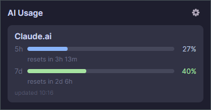

# KB.AI.Usage

A system-tray app that tracks your AI tool usage locally. No telemetry, no cloud.
Monitors rate limits and quotas for **Claude.ai**, **ChatGPT**, and **GitHub Copilot** —
connect each from inside the app, no manual token pasting.



## Download

Go to [Releases](../../releases/latest) and grab the file for your platform:

| Platform      | File                                | Notes                  |
|---------------|-------------------------------------|------------------------|
| Windows       | `KB.AI.Usage-Setup.exe`             | Installer              |
| macOS (M1+)   | `KB.AI.Usage-osx-arm64.zip`         | Apple Silicon          |
| macOS (Intel) | `KB.AI.Usage-osx-x64.zip`           | Intel                  |

## Installation

### Windows

Run `KB.AI.Usage-Setup.exe`.

SmartScreen may block it (the app is not code-signed):
click **More info** → **Run anyway**.

### macOS

Unzip the archive. Before first launch, remove the quarantine flag (Gatekeeper
blocks unsigned apps):

```bash
xattr -dr com.apple.quarantine KB.AI.Usage.app
```

Alternatively: right-click the `.app` → Open → Open.

## First launch

The app appears in the system tray. Click the tray icon (or choose **Status** from the tray menu) to see the dashboard,
then the **⚙ gear** to open Settings.

> Tip (Windows): if the tray icon hides in the overflow (⌃) flyout, drag it onto the
> taskbar, or enable it under Settings → Personalization → Taskbar → *Other system tray icons*.

### Connecting providers

Everything is done from the in-app **Settings** panel — no config files, no DevTools,
no token pasting. Each provider has a **Connect** button (and **Disconnect** to revoke):

- **Claude.ai** — Connect opens a login window; sign in once and the app reuses the
  session to read your 5h + weekly limits.
- **ChatGPT** — Connect opens a login window. Note: ChatGPT only exposes usage data on
  **paid plans** (Plus / Pro / Codex). On a free account the tile says so — there's no
  quota API to read.
- **GitHub Copilot** — Connect starts a GitHub **device-flow** sign-in: your browser
  opens with a code to authorize. After that the tile shows your premium-request quota.

### Customising the dashboard

In Settings you can also pick a **theme** (Mocha / Latte / Nord) and accent colour,
**enable/disable** tiles, **drag to reorder** them, switch each tile between **small/large**,
and set an **alert threshold** (default 80%) that highlights a tile when usage gets close.

Config is stored at `%APPDATA%\AiUsage\config.json` (Windows) or
`~/.config/AiUsage/config.json` (macOS/Linux), but you normally never need to touch it.

## Reporting issues

Open an [issue](../../issues) in this repo.
